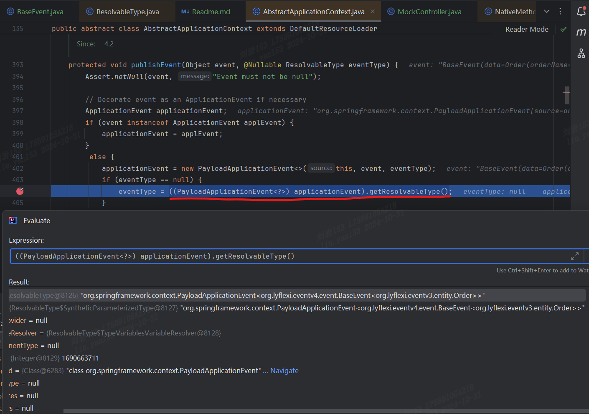

Spring在泛型情况下的事件处理解决方案：

> https://docs.spring.io/spring-framework/reference/core/beans/context-introduction.html#context-functionality-events-generics

# 实现接口ResolvableTypeProvider
```java
@Data
public class BaseEvent<T>  implements ResolvableTypeProvider {
    private T data;
    private String addOrUpdate;

    public BaseEvent(T data, String addOrUpdate) {
        this.data = data;
        this.addOrUpdate = addOrUpdate;
    }

    @Override
    public ResolvableType getResolvableType() {
        return ResolvableType.forClassWithGenerics(getClass(), ResolvableType.forInstance(getData()));
    }
}
```
# 断点调试
## 在方法实现的入口处打上断点


跟踪堆栈信息，定位到ResolvableType.java, 在静态方法forInstance中找到了ResolvableTypeProvider#getResolvableType方法的调用


弹栈追踪 PayloadApplicationEvent.java用于保存通过ResolvableType.forInstance生成的带有泛型信息的event

- private final ResolvableType payloadType;此时为org.lyflexi.eventv4.event.BaseEvent<org.lyflexi.eventv3.entity.Order>


弹栈追踪AbstractApplicationContext.java


这里的PayloadApplicationEvent又对org.lyflexi.eventv4.event.BaseEvent<org.lyflexi.eventv3.entity.Order>通过接口ResolvableTypeProvider包装了一层

因此PayloadApplicationEvent#getResolvableType()返回的是：

- org.springframework.context.PayloadApplicationEvent<org.lyflexi.eventv4.event.BaseEvent<org.lyflexi.eventv3.entity.Order>>

```shell
org.springframework.context.PayloadApplicationEvent<org.lyflexi.eventv4.event.BaseEvent<org.lyflexi.eventv3.entity.Order>>
```

解决了泛型擦除了问题


# 如果说不实现接口ResolvableTypeProvider再次调试
```java
@Data
public class BaseEvent<T>  /*implements ResolvableTypeProvider */{
    private T data;
    private String addOrUpdate;

    public BaseEvent(T data, String addOrUpdate) {
        this.data = data;
        this.addOrUpdate = addOrUpdate;
    }

/*    @Override
    public ResolvableType getResolvableType() {
        return ResolvableType.forClassWithGenerics(getClass(), ResolvableType.forInstance(getData()));
    }*/
}
```
发现这里的泛型信息Order被擦除成？了，这也就是泛型event不生效的原因
```shell
org.springframework.context.PayloadApplicationEvent<org.lyflexi.eventv4.event.BaseEvent<?>>
```


继续退栈，来到事件发布的入口处，发现spring一直加工的就是我们publish的BaseEvent<Order>

正常情况下泛型信息Order是会被擦除的

但是经过spring上述一系列的操作之后，泛型信息Order保留了下来


# 话说回来，进一步探究我们`BaseEvent<T>`的实现中到底做了什么？
BaseEvent<T>#getResolvableType
```java
    @Override
    public ResolvableType getResolvableType() {
        return ResolvableType.forClassWithGenerics(getClass(), ResolvableType.forInstance(getData()));
    }
```
- ResolvableType.forInstance(getData())
- ResolvableType.forClassWithGenerics
## 1.ResolvableType.forInstance(getData())

就是返回了目标泛型的具体类型：Order
## 2.ResolvableType.forClassWithGenerics

为我们创建好带有目标泛型的BaseEvent<Order>：org.lyflexi.eventv4.event.BaseEvent<org.lyflexi.eventv3.entity.Order>

所以彻底清楚了，在事件发布的时候，spring对带有泛型的event进行了偷天换日，避免了Java泛型信息的擦除

此后就按照spring正常的事件发布流程往下走，本文就不再赘述...
